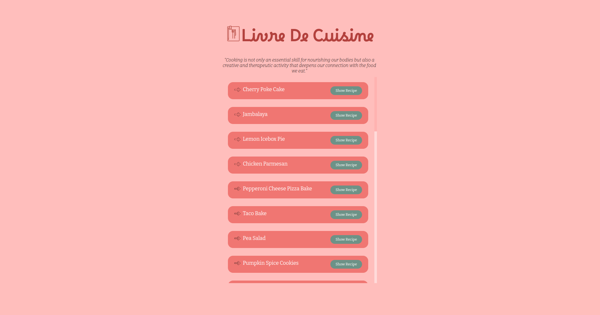
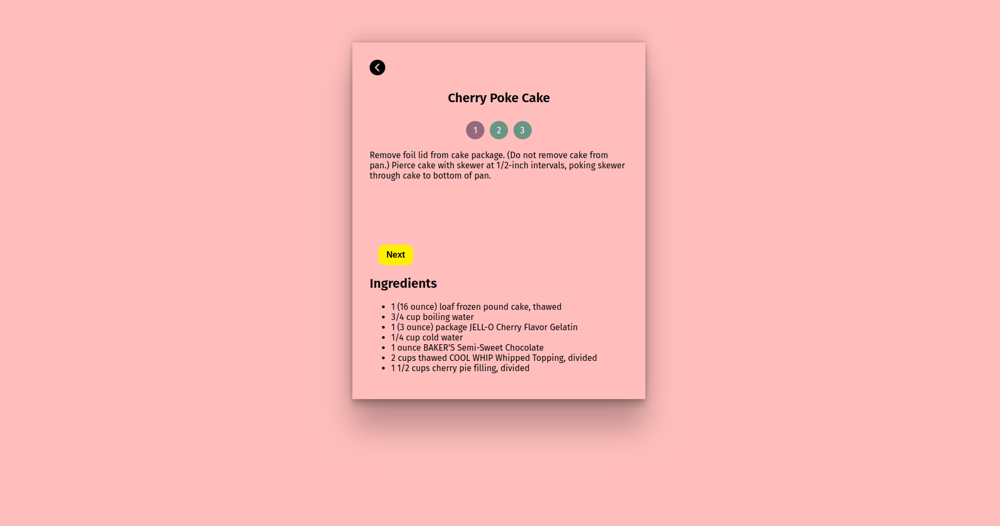

# Livre De Cuisine

Welcome to Livre De Cuisine repository! This project is a user-friendly platform for sharing and discovering cooking recipes, complete with step-by-step instructions.

## About

Livre De Cuisine is a website tailored to every food lover's needs! Embark on a delicious journey with us, exploring new cuisines as well as refining my skills in ReactJS state managements.

## Features

- Browse a diverse collection of recipes from western cuisines.
- Get detailed step-by-step instructions for each recipe.
- User-friendly interface with responsive design for mobile and desktop.

<!-- ## Demo

Check out the live demo of the Livre De Cuisine Website: [Demo Link](https://www.cookingstepwebsite.com) -->

## Screenshots

## Installation

1. Clone the repository: `git clone https://github.com/miggy-pg/cooking_steps`
2. Navigate to the project directory: `cd cooking_steps`
3. Install dependencies: `npm install`

## Usage

1. Run the application: `npm start`
2. Open your browser and go to: `http://localhost:3000`
3. Explore and enjoy cooking!

## Technologies Used

- 
- 
- 

## Contributing

Contributions are welcome! If you'd like to contribute to the Livre De Cuisine website, please follow these steps:

1. Fork the repository.
2. Create a new branch: `git checkout -b feature/your-feature-name`
3. Make your changes and commit them: `git commit -m "Add some feature"`
4. Push to your forked repository: `git push origin feature/your-feature-name`
5. Create a pull request.

## Contact

Feel free to reach out to me via email at your@email.com or connect with me on [LinkedIn](https://www.linkedin.com/in/migui-galan/).
